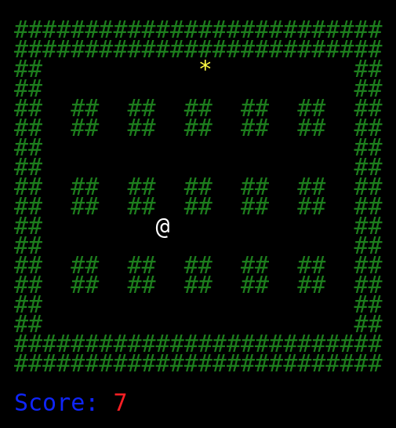

[](https://travis-ci.org/carlwillimott/cavecrusader)
[](https://coveralls.io/github/carlwillimott/cavecrusader?branch=master)

# Cave Crusader
A simple canvas game that involves moving a character around the map in order to collect randomly generated stars.

<a href="https://carlwillimott.github.io/cavecrusader/docs/index.html" target="_blank">Demo</a>

## Usage
```html
        <canvas id="cc" width="525px" height="550px"></canvas>
        
        <script type="module">

            import CaveCrusader from "./script.js";

            const map = [
                '######################',
                '######################',
                '##         @        ##',
                '##  ##  ##  ##  ##  ##',
                '##  ##  ##  ##  ##  ##',
                '##                  ##',
                '######################',
                '######################',
            ];

            new CaveCrusader('cc', map);

        </script>
```

## Example
<p align="center">
  
</p>